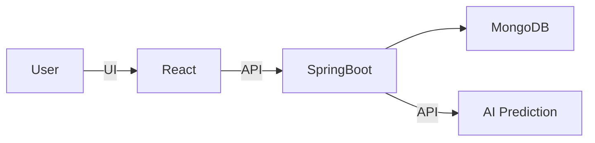

# 🏟️ Sport Center Management

**Sport Center Management** is a web application for managing sports centers.  
It allows users to **book sports courts in real-time**, participate in tournaments, view sports courses, and provides admins with a **full-featured dashboard** to manage sports, courts, bookings, users, and revenue – **and more**.

Built with **Spring Boot (backend)**, **React (frontend)**, and **MongoDB (database)**.

---

## 🚀 Demo / Screenshot

  
  

  
  

  
  

---

## ⚙️ System Architecture

- **Backend:** Spring Boot, Spring Security & JWT, Spring Data MongoDB, REST API, WebSocket, Kafka, Validation, Mail, Thymeleaf, Cloudinary  
- **Frontend:** React, React Router, Axios, React Hooks, Ant Design, Material-UI, Bootstrap, Recharts & Chart.js, React Toastify, WebSocket (SockJS + STOMP)  
- **Database:** MongoDB  
- **AI Module:** Uses machine learning (Random Forest) to predict court booking likelihood based on input data, encouraging users to book and applying appropriate discounts to help balance booking rates  
- **Deployment:** [https://huynhtri123.github.io/sport-center/](https://huynhtri123.github.io/sport-center/) (Initial load may take a few minutes due to cold start on free backend hosting)

